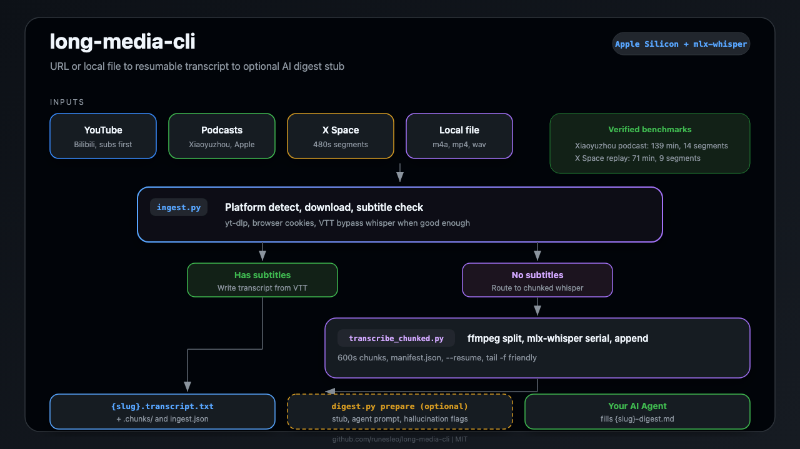

# long-media-cli

[](LICENSE)

**English** · [中文](README.zh.md)

Turn a long podcast, YouTube video, or X Space into a resumable transcript on Apple Silicon — without a 90-minute whisper job that looks hung or writes 0 bytes.

One command: URL or local file → download (subtitle-first for YouTube/Bilibili) → chunked mlx-whisper → `{slug}.transcript.txt`. Optional digest stub for your AI agent.

<p align="center">
  <a href="docs/architecture.svg">
    
  </a>
</p>

## What you get

- **Unified ingest** — YouTube, Bilibili, Xiaoyuzhou (小宇宙), X Space, Apple Podcasts, or local audio/video in one CLI.
- **Chunked transcription** — ffmpeg splits long audio; mlx-whisper runs **serially**; each segment **appends** to the output file (`tail -f` friendly).
- **Resume after interrupt** — `manifest.json` + `--resume`; no full restart on 60+ minute sources.
- **Subtitle-first for video** — tries VTT/subs before whisper when available.
- **Digest stub (v0.2+)** — `digest.py prepare` writes chapter skeleton + agent prompt; flags mlx repetition hallucinations on intro/outro segments.

## How it works

```text
URL or local file
    ↓ ingest.py (platform detect → download or subs)
    ↓ transcribe_chunked.py (if no usable subtitles)
    ↓ {slug}.transcript.txt + {slug}.ingest.json
    ↓ digest.py prepare (optional)
    ↓ your Agent fills {slug}-digest.md
```

**Input** (Xiaoyuzhou episode):

```bash
python3 ingest.py "https://www.xiaoyuzhoufm.com/episode/EPISODE_ID" \
  --out-dir ./output --language zh --resume
```

**Output**:

```text
output/
  episode-slug.m4a
  episode-slug.transcript.txt          # incremental, segment markers
  episode-slug.transcript.txt.chunks/  # manifest + segment mp3s
  episode-slug.ingest.json             # run metadata
```

**Short video with subtitles** — ingest may skip whisper entirely and write transcript from VTT.

## Setup

**Clone and install dependencies:**

```bash
git clone https://github.com/runesleo/long-media-cli.git
cd long-media-cli
chmod +x ingest.sh ingest.py digest.py space_pipeline.sh long_media.sh

brew install ffmpeg yt-dlp
pipx install mlx-whisper
```

**Any AI coding agent:**

Point your agent at `docs/ingest.md` + `docs/digest-template.md`. The pipeline is plain Python + shell — no framework lock-in.

## Requirements

- macOS Apple Silicon (M-series) — primary tested platform
- `ffmpeg`, `ffprobe`, `yt-dlp`
- `mlx_whisper` (`pipx install mlx-whisper`) — default engine
- Optional: `faster-whisper` (`--engine faster`), OpenAI API (`--engine openai` + `OPENAI_API_KEY`)
- YouTube / X Space download: `--cookies-from-browser chrome` (default) or your browser of choice

**Privacy note:** By default, `ingest.py` and `download_twitter_space.py` pass `--cookies-from-browser chrome` to yt-dlp so authenticated downloads work. That reads cookies from your local Chrome profile on this machine only — nothing is uploaded by this CLI. To disable: `--cookies-from-browser ""` or set an empty value in the shell wrapper.

## Quick start

```bash
# Podcast / Xiaoyuzhou
./ingest.sh "https://www.xiaoyuzhoufm.com/episode/..." ./output zh

# YouTube (subs first, else whisper)
./ingest.sh "https://www.youtube.com/watch?v=..." ./output zh

# X Space (480s segments)
./ingest.sh "https://x.com/i/spaces/SPACE_ID" ./output zh 480

# Local file
./ingest.sh ./episode.m4a ./output zh 600

# Digest stub after transcript complete
python3 digest.py status ./output/episode.transcript.txt
python3 digest.py prepare ./output/episode.transcript.txt
```

Low-level transcribe only:

```bash
python3 transcribe_chunked.py episode.m4a \
  --out episode.transcript.txt \
  --language zh --engine mlx --segment-sec 600 --resume
```

## Verified

Tested on MacBook Pro Apple Silicon · `mlx_whisper` · production runs (not re-run for every tag).

| Source | Duration | Segments | Result |
|--------|----------|----------|--------|
| Xiaoyuzhou podcast | ~139 min | 14 × 600 s | 14/14 · incremental transcript |
| X Space replay | ~71 min | 9 × 480 s | 9/9 · seg_0/seg_8 may hallucinate (mlx intro/outro) |

See [docs/chunked-local.md](docs/chunked-local.md) for resume/progress details.

## Known limitations (v0.2)

- **Long audio only** — designed for >20 min sources; short clips may over-chunk.
- **mlx intro/outro hallucination** — some Spaces/podcasts repeat lyrics-like garbage in first/last segment; `digest.py prepare` flags these — review or re-run those segments.
- **Bilibili** — uses direct API (yt-dlp 412 workaround); may break if API changes.
- **Xiaoyuzhou** — scrapes CDN URL from page HTML; SPA changes may require script update.
- **Digest body** — CLI writes stub + agent prompt only; LLM summary is Agent-driven, not built-in.
- **No Windows/Linux CI** — Apple Silicon + mlx is the happy path; `faster` engine is the CPU fallback.

## Roadmap

**Ingest**
- [ ] pyproject.toml + `pip install` entry point
- [ ] `--engine` auto-detect when mlx unavailable

**Transcribe**
- [ ] Optional segment re-run by index (fix hallucinated seg_0/seg_8 without full job)
- [ ] Speaker diarization hook (short files / per-segment)

**Digest**
- [ ] Optional LLM backend behind env flag (opt-in, not default)

## About the author

*Leo ([@runes_leo](https://x.com/runes_leo)) — AI × Crypto independent builder. Trading on [Polymarket](https://polymarket.com/?via=runes-leo&r=runesleo&utm_source=github&utm_content=long-media-cli), building data and content pipelines with Claude Code and Codex.*

*[leolabs.me](https://leolabs.me) — writing · community · open-source tools · indie projects · all platforms.*

*[X Subscription](https://x.com/runes_leo/creator-subscriptions/subscribe) — paid content weekly, or just buy me a coffee 😁*

*Learn in public, Build in public.*

## License

MIT — see [LICENSE](LICENSE).
